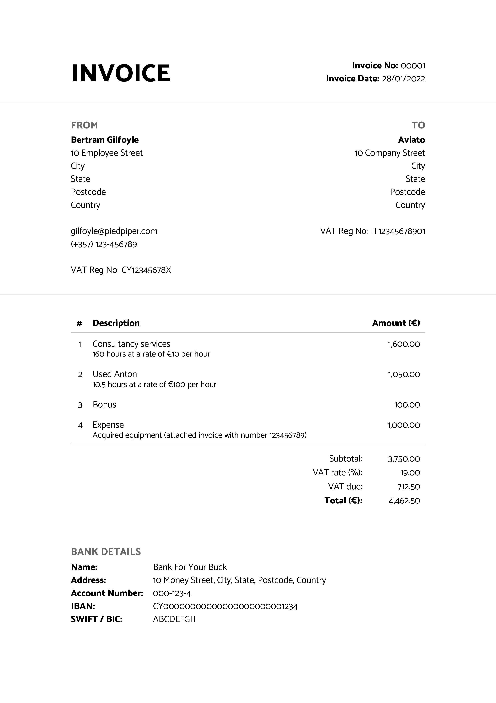
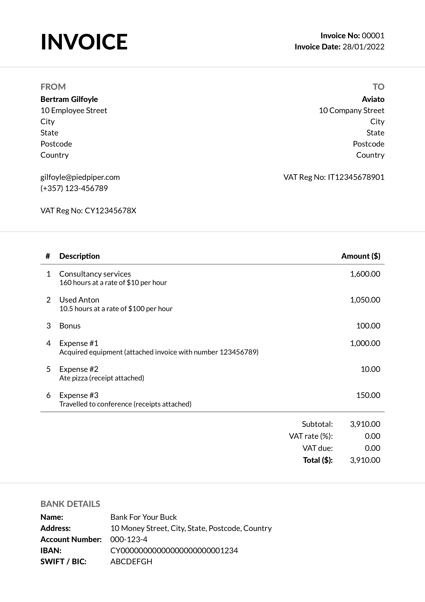

# Simple Invoice Generator

A simple invoice generator using [pandoc](https://pandoc.org) and [LaTeX](https://www.latex-project.org).
A YAML data file is used to configure the output of the resulting pdf.
Scroll to the bottom for example invoices.

## Data File

A `data.yml` file is required to configure the output of the resulting pdf.
An example data file is shown in [`data.example.yml`](data.example.yml).
All keys are detailed below.
Unless specified otherwise, values are treated as raw strings.
Note that the YAML file must be properly terminated (`---` at the end of the file) otherwise pandoc will have trouble loading it.

```yaml
fonts_path: '/fonts'
font: 'OpenSans'
fontsize: '10pt'
geometry: 'left=20mm,right=20mm,top=20mm,bottom=20mm'
```

`fonts_path` is a hardcoded (😱) internal variable used for automation purposes and should be left unchanged.

`font` must be one of:

```
Catamaran
Dosis
FiraSans
Lato
Montserrat
NotoSans
Nunito
OpenSans
Oxygen
Poppins
Quicksand
Raleway
SourceSansPro
Ubuntu
```

`fontsize` can be any valid font size that can be read by `\documentclass` in LaTeX.

`geometry` can be any valid geometry configuration that can be read by `\geometry` in LaTeX.

```yaml
invoice-number: '00001'
date: '31/01/2022'
```

`invoice-number` is the invoice number in string format.

`date` is the date the invoice was issued on.

```yaml
from:
  name: 'Bertram Gilfoyle'
  contact-details:
    - '10 Employee Street'
    - 'City'
    - 'State'
    - 'Postcode'
    - 'Country'
    -
    - 'gilfoyle@piedpiper.com'
    - '(+357) 123-456789'
  tax-identification-number: 'CY12345678X'
  vat-registration-number: 'CY12345678X'
  bank-details:
    name: 'Bank For Your Buck'
    address: '10 Money Street, City, State, Postcode, Country'
    account-number: '000-123-4'
    iban: 'CY00000000000000000000001234'
    swift: 'ABCDEFGH'
```

`from` is map containing details about the issuer of the invoice.

`from.name` is the name of the issuer of the invoice.

`from.contact-details` are the contact details (address, email, phone number, etc) of the issuer of the invoice.
Provided in list format.
Each element in the list will sit on its own line.

`from.tax-identification-number` is the tax identification number of the issuer of the invoice.
Optional.

`from.vat-registration-number` is the VAT registration number of the issuer of the invoice.
Optional.

`from.bank-details` are the bank details of the issuer of the invoice.
All nested variables are required.

```yaml
to:
  name: 'Aviato'
  vat-registration-number: 'IT12345678901'
  address:
    - '10 Company Street'
    - 'City'
    - 'State'
    - 'Postcode'
    - 'Country'
```

`to` is map containing details about the recipient of the invoice.

`to.name` is the individual / company name of the recipient of the invoice.

`to.vat-registration-number` is the VAT registration number of the recipient of the invoice.

`to.address` is the address of the recipient of the invoice.
Provided in list format.
Each element in the list will sit on its own line.

```yaml
currency: '€'
vat-rate: 20
```

`currency` is the currency to be used on the invoice.

`vat-rate` is the VAT rate.
Must be a number in the range 0-100.

```yaml
services:
  - description: 'Consultancy services'
    hourly:
      hours: 160
      rate: 10.00
  - description: 'Used Anton'
    hourly:
      hours: 10.50
      rate: 100.00
  - description: 'Bonus'
    other:
      price: 100.00
  - description: 'Expense \#1'
    other:
      price: 1000.00
      details: 'Acquired equipment (attached invoice with number 123456789)'
  - description: 'Expense \#2'
    other:
      price: 10.00
      details: 'Ate pizza (receipt attached)'
  - description: 'Expense \#3'
    other:
      price: 150.00
      details: 'Travelled to conference (receipts attached)'
```

`services` is a list of maps detailing the services / goods the invoice is for.

`services[].description` is a description of the service / good provided.

`services[].hourly` is a map requiring two keys: `hours` and `rate`.
The values of both keys must be numbers.
This should be used to describe hourly services; the total will be calculated automatically.
A note will be added under the service description stating the amount of hours worked and the agreed upon rate.
`services[].hourly` takes precedence over `services[].other`.

`services[].other` is a map requiring one key (`price`), with another key (`details`) being optional.
`services[].other.price` is the cost of the service / good provided.
Must be a number.
`services[].other.details` is optional and is added under the service description when provided.
`services[].hourly` takes precedence over `services[].other`.

## Running

`cd` to the root of this repository, then build the Docker image:

```
docker build --tag simple-invoice-generator .
```

`cd` to a working directory that includes a `data.yml` file.
Run a container while bind-mounting the working directory:

```shell
docker run --rm --user $(id -u):$(id -g) --volume=$(pwd):/datadir simple-invoice-generator
```

Once the container finishes its task, an `invoice.pdf` file should exist in your working directory.
Edit `data.yml` and run the earlier command again to generate more invoices.

## Example Invoices




