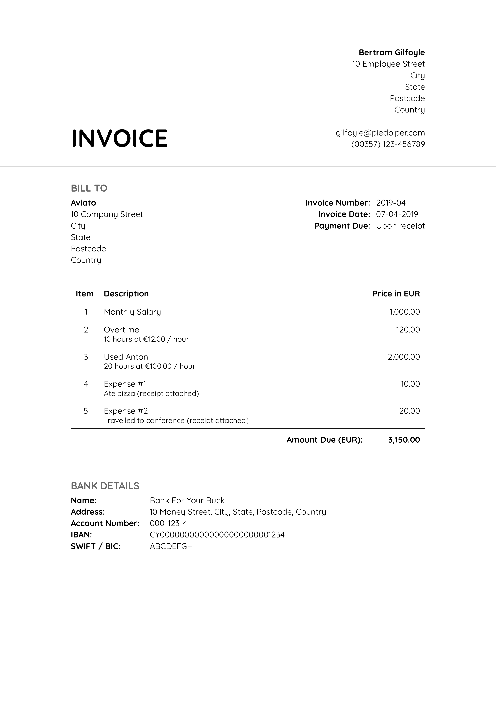
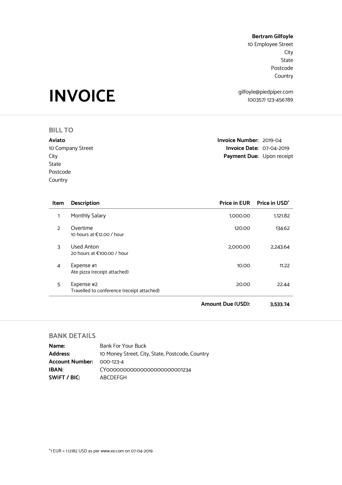

# Simple Invoice Generator

A simple invoice generator using [pandoc](https://pandoc.org) and [LaTeX](https://www.latex-project.org).
A YAML data file is used to configure the output of the resulting pdf.
Scroll to the bottom for example invoices.

## Data File

A `data.yml` file is required to configure the output of the resulting pdf.
An example data file is shown in [`data.yml.example`](data.yml.example).
All keys are detailed below.
Unless specified otherwise, values are treated as raw strings.

```yaml
font: Open Sans
fontsize: 10pt
geometry: left=30mm,right=30mm,top=20mm,bottom=20mm
```

`font` can be one of:

- Catamaran
- Dosis
- Lato
- Open Sans
- Quicksand
- Raleway
- Roboto
- Ubuntu

`fontsize` can be any valid font size that can be read by `\documentclass` in LaTeX.

`geometry` can be any valid geometry configuration that can be read by `\geometry` in LaTeX.

```yaml
invoice-number: 2019-04
date: 07-04-2019
```

`invoice-number` is the invoice number.

`date` is the date the invoice was issued on.

```yaml
issuer:
  name: Bertram Gilfoyle
  address:
    - 10 Employee Street
    - City
    - State
    - Postcode
    - Country
    -
    - gilfoyle@piedpiper.com
    - (00357) 123-456789
  bank-details:
    name: Bank For Your Buck
    address: 10 Money Street, City, State, Postcode, Country
    account-number: 000-123-4
    iban: CY00000000000000000000001234
    swift: ABCDEFGH
```

`name` is the name of the issuer of the invoice.

`address` is the address of the issuer of the invoice.
Provided in list format.
Each element in the list will sit on its own line.

`bank-details` are the bank details of the issuer of the invoice.
All nested variables are required.

```yaml
recipient:
  name: Aviato
  address:
    - 10 Company Street
    - City
    - State
    - Postcode
    - Country
```

`name` is the name of the recipient of the invoice.

`address` is the address of the recipient of the invoice.
Provided in list format.
Each element in the list will sit on its own line.

```yaml
currency: EUR
convert-currency-to: USD
exchange-rate: 2.0
```

`currency` is the currency used in paperwork / agreements.

`convert-currency-to` is the currency that will be used for payment.
If undefined, `currency` is used instead.
If not undefined, `exchange-rate` must also be defined and set.

`exchange-rate` is the exchange rate between `currency` and `convert-currency-to`.
Must be defined and set if `convert-currency-to` is defined.
Must be a number.
Used to calculate the prices in the currency that will be used for payment.
Assumed to have been set according to www.xe.com.

```yaml
services:
  - description: Monthly Salary
    price: 1000.00
  - description: Overtime
    details: 10 hours at €12.00 / hour
    price: 120.00
  - description: Used Anton
    details: 20 hours at €100.00 / hour
    price: 2000.00
  - description: Expense \#1
    details: Ate pizza (receipt attached)
    price: 10.00
  - description: Expense \#2
    details: Travelled to conference (receipt attached)
    price: 20.00
```

`services` is a list of dictionaries detailing the services / goods the invoice is for.

`description` is a description of the service / good provided.

`details` are details regarding the service / good provided.
This is optional.

`price` is the cost of the service / good provided.
Price must reflect the currency provided in `currency`.
Must be a number.

## Running

`cd` to a working directory that includes a `data.yml` file.
Then run

```shell
docker run --rm --user $(id -u):$(id -g) --volume=$(pwd):/datadir loizoskounios/simple-invoice-generator
```

Once the image is pulled and ran, an `invoice.pdf` file should exist in your working directory.
Edit `data.yml` and re-run the command above to generate more invoices.

## Example Invoices




